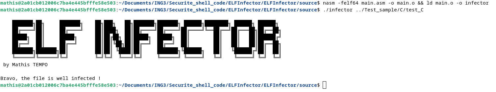

# **ELFInfector**

This assembler-coded project is designed to infect any ELF file.

## **Description**

**ELFInfector** is a tool for infecting ELF files with a payload. In this project, the payload is a simple /bin/sh. This project is mainly used for educational purposes and to study ELF file manipulation techniques.

**The repo contains the source code in the source folder, as well as a Test_sample folder containing ELF executables for testing purposes.** 

## **Usage**

To infect an ELF file with a payload, compile the source code with : 

nasm -felf64 main.asm -o main.o && ld main.o -o infector

Then run the command : 

./infector /path/to/elf

